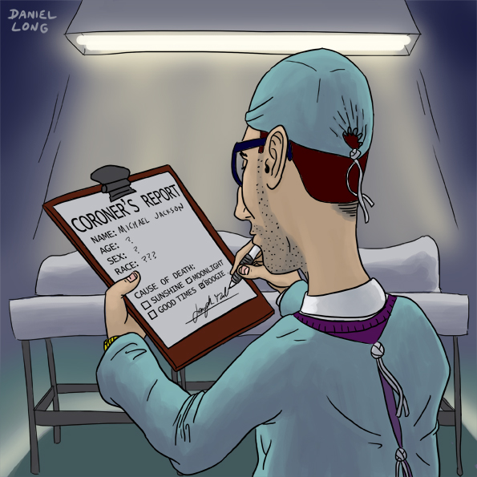

# Postmortem
> Web stack debugging #3

<p align="center">
    
</p>

## 📝 Issue summary 📋
- **Duration of Outage**: April 15, 2024, 14:00 - 16:30 GMT
- **Impact**: The company website was returning a 500 Internal Server Error. Users were unable to access the site or any of its services during this period. Approximately 90% of the users were affected.
- **Root Cause**: The root cause was a typographical error in the PHP configuration files, specifically a typo (.phpp instead of .php) in the wp-settings.php file.

## ⏲ Timeline ⏱
- **14:00 GMT**: Issue detected through a monitoring alert indicating that the website was down.
- **14:05 GMT**: An engineer confirmed the issue by accessing the website and receiving a 500 Internal Server Error.
- **14:10 GMT**: Initial investigation began by checking the Apache logs and configuration files.
- **14:20 GMT**: No issues were found in the Apache configuration; the investigation moved to the PHP and application logs.
- **14:40 GMT**: strace was attached to the running Apache process to identify the system calls and errors being generated.
- **15:00 GMT**: The strace output indicated a "No such file or directory" error related to a .phpp file.
- **15:10 GMT**: The team searched for files containing .phpp and identified the typo in wp-settings.php.
- **15:20 GMT**: The typo was corrected manually, and the Apache server was restarted. The website came back online.
- **15:30 GMT**: Further investigation to ensure no other instances of the typo existed.
- **16:00 GMT**: Automation of the fix using Puppet to prevent future occurrences.
- **16:30 GMT**: Full resolution confirmed, and services were fully restored.

## 🔨⚰ Root cause and Resolution 🩹
<p align="center">
     
</p>

- **Root Cause**: The root cause was a typo in the wp-settings.php file where class-wp-locale.phpp was mistakenly written instead of class-wp-locale.php. This typo caused the PHP interpreter to fail when including the file, resulting in a 500 Internal Server Error.
- **Resolution**:
    - The typo was identified by attaching strace to the Apache process and observing the "No such file or directory" error.
    - Once the typo was located, it was manually corrected, and the Apache server was restarted to restore functionality.
    - To prevent future occurrences, a Puppet manifest was created to automate the correction of the typo:
```rb
# Puppet manifest to fix the typo error in wp-settings.php

$typo_file = '/var/www/html/wp-settings.php'

# Ensure the file is present
file { $typo_file:
  ensure => 'present',
  mode   => '0644',  # Ensure proper permissions
  owner  => 'www-data',
  group  => 'www-data',
}

# Correct the typo error using an exec resource
exec { 'correct_phpp_typo':
  command => "sed -i 's/class-wp-locale.phpp/class-wp-locale.php/g' ${typo_file}",
  path    => ['/bin', '/usr/bin'],
  onlyif  => "grep 'class-wp-locale.phpp' ${typo_file}",  # Only run if the typo exists
  require => File[$typo_file],  # Ensure the file resource is managed before executing the command
}
```

## 🛡 Corrective and Preventative measures 🗡
- **Improvements**:
    - Enhance code review processes to catch such typographical errors before deployment.
    - Implement comprehensive monitoring and alerting for application errors, not just service availability.
    - Increase automated testing coverage to include configuration files and ensure they are correctly formatted.
- **Tasks**:
    - **Patch Nginx Server**: Ensure all servers are patched and configurations are correct.
    - **Add Monitoring**: Implement monitoring for server memory, disk usage, and application-specific errors.
    - **Automate Configuration Fixes**: Use Puppet or a similar tool to automate corrections for common configuration errors.
    - **Enhance Testing**: Expand automated tests to cover configuration file syntax and common errors.
    - **Conduct Training**: Provide additional training for developers on the importance of configuration management and error handling.
